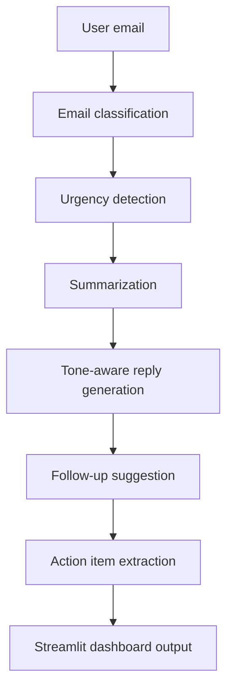

# MailPilot AI

MailPilot AI is an AI-powered email reply assistant built with Streamlit, LangChain, and Groq. It turns pasted email content into a compact workspace with intent classification, urgency detection, summary, smart reply, follow-up plan, and action items.

## Features

- Email classification: support request, complaint, meeting request, sales inquiry, follow-up, or casual
- Urgency detection: urgent, medium, or low priority
- Professional summary with key points and sender intent
- Tone-aware reply generation
- Action item and deadline extraction
- Follow-up suggestions
- Dark SaaS dashboard UI with copy panels and reply download
- Demo fallback mode when no API key is configured

## Tech Stack

| Layer | Technology |
| --- | --- |
| Frontend | Streamlit |
| Backend | Python |
| AI Provider | Groq API |
| AI Framework | LangChain |
| Model | `llama-3.3-70b-versatile` |
| Environment | `python-dotenv` |

## Project Structure

```text
mailpilot-ai/
├── app.py
├── requirements.txt
├── .env.example
├── README.md
├── src/
│   ├── classifier.py
│   ├── summarizer.py
│   ├── reply_generator.py
│   ├── followup_generator.py
│   ├── task_extractor.py
│   ├── tone_manager.py
│   ├── prompts.py
│   ├── llm.py
│   └── utils.py
├── assets/
│   ├── styles.css
│   └── logo.png
├── screenshots/
└── output/
```

## Architecture



## Setup

1. Create and activate a virtual environment.

```bash
python -m venv .venv
.venv\Scripts\activate
```

2. Install dependencies.

```bash
pip install -r requirements.txt
```

3. Configure Groq.

```bash
copy .env.example .env
```

Add your key:

```env
GROQ_API_KEY=your_groq_api_key
```

4. Run the app.

```bash
streamlit run app.py
```

## Testing Scenarios

Support or complaint email:

```text
My order has not arrived yet and I need an update urgently.
```

Expected output:

- Complaint or support classification
- Urgent priority
- Polite apology or escalation-ready reply
- Action item to investigate the issue

Meeting request:

```text
Can we schedule a meeting next Tuesday?
```

Expected output:

- Meeting request classification
- Medium or low priority
- Friendly professional reply
- Action item to schedule the meeting

## Deployment

Good deployment options:

- Streamlit Cloud
- Render
- Railway

For Streamlit Cloud, add `GROQ_API_KEY` in the app secrets or environment variable settings.

## Future Improvements

- Gmail inbox integration
- Sentiment analysis
- Calendar availability suggestions
- Auto-draft mode for unread emails
- PDF export for generated replies
