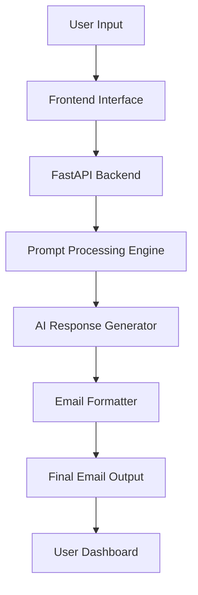
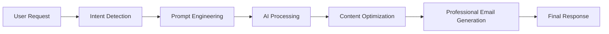
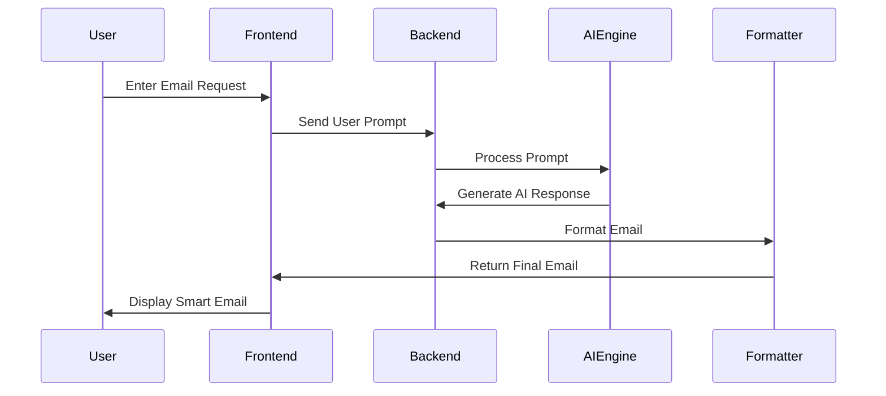
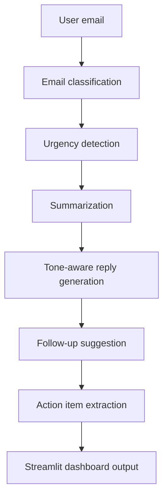

# 🚀 MailPilot AI – Intelligent Email Automation & AI Communication Assistant

<div align="center">


### 📧 AI-Powered Smart Email Management & Automation Platform

</div>

---

# 📌 Overview

MailPilot AI is a modern AI-powered email automation and communication assistant designed to simplify professional email workflows through intelligent automation, smart content generation, and conversational AI interaction.

The platform combines Artificial Intelligence, Prompt Engineering, and modern backend architecture to help users generate professional emails, automate repetitive communication tasks, optimize email productivity, and manage communication workflows efficiently.

MailPilot AI delivers a responsive and intelligent experience using FastAPI, Python, and AI-based natural language processing systems.

---

# ✨ Core Features

## 🤖 AI Email Assistant
- Human-like AI email generation
- Smart conversational interaction
- Context-aware response generation
- Professional tone optimization

## 📧 Intelligent Email Writing
- Professional email drafting
- Formal & informal tone generation
- AI-enhanced grammar correction
- Smart subject line generation

## ⚡ Email Automation
- Automated workflow handling
- Dynamic email templates
- Faster communication management
- Productivity-focused automation

## 🧠 Prompt Engineering System
- Context-aware AI prompting
- Smart response refinement
- Personalized communication generation
- Adaptive AI interaction flow

## 🔒 Secure Architecture
- Environment-based API security
- Protected backend structure
- Secure authentication handling
- Safe user configuration management

## 🌐 Modern Responsive Interface
- Responsive UI/UX
- Interactive frontend
- Fast loading experience
- Professional dashboard structure

---

# 🛠️ Tech Stack

## Frontend
- HTML5
- CSS3
- JavaScript

## Backend
- Python
- FastAPI

## AI Integration
- OpenAI API
- Prompt Engineering
- Conversational AI

## Data Management
- JSON-based storage
- Secure configuration handling

## Development Tools
- Git & GitHub
- VS Code
- Virtual Environment (venv)

---

# 🧠 System Architecture



---

# ⚙️ AI Workflow



---

# 🤖 AI Agent Working Flow



---
## Project Structure

```text
mailpilot-ai/
├── app.py
├── requirements.txt
├── .env.example
├── README.md
├── src/
│   ├── classifier.py
│   ├── summarizer.py
│   ├── reply_generator.py
│   ├── followup_generator.py
│   ├── task_extractor.py
│   ├── tone_manager.py
│   ├── prompts.py
│   ├── llm.py
│   └── utils.py
├── assets/
│   ├── styles.css
│   └── logo.png
├── screenshots/
└── output/
```

## Architecture



## Setup

1. Create and activate a virtual environment.

```bash
python -m venv .venv
.venv\Scripts\activate
```

2. Install dependencies.

```bash
pip install -r requirements.txt
```

3. Configure Groq.

```bash
copy .env.example .env
```

Add your key:

```env
GROQ_API_KEY=your_groq_api_key
```

4. Run the app.

```bash
streamlit run app.py
```
---

# 🚀 Usage

- Open the application in browser
- Enter email instructions or prompts
- AI analyzes communication intent
- System generates optimized professional emails
- User can edit, copy, and use generated responses

---

# 🧠 AI Functionalities

MailPilot AI uses advanced AI techniques to:

- Generate human-like emails
- Improve communication quality
- Automate repetitive writing tasks
- Optimize professional email tone
- Understand conversational context
- Enhance productivity workflows

---


# 🔒 Security Features

- API key protection using `.env`
- Secure backend architecture
- Isolated AI processing
- Configuration security handling
- Safe user data processing

---

# 📈 Future Enhancements

- Gmail Integration
- Outlook Integration
- AI Smart Reply Suggestions
- Email Scheduling System
- Multi-language Support
- AI Inbox Categorization
- Voice-to-Email Conversion
- Team Collaboration Features
- Analytics Dashboard

---

# 👩‍💻 Developer

## Amna Chaudhary

AI & Full Stack Developer focused on building intelligent automation systems, AI-powered productivity tools, and conversational web applications.

---

# 🤝 Contribution

Contributions are welcome!

```bash
Fork the repository
Create a feature branch
Commit your changes
Push to your branch
Create Pull Request
```

---

# 📜 License

This project is licensed under the MIT License.

---

# ⭐ Support

If you like this project:

⭐ Star the repository  
🍴 Fork the project  
📢 Share with others  

---

# 📬 Repository

## GitHub Repository

👉 https://github.com/amna-techcorp17/MailPilot-AI

---

<div align="center">

# ✨ Transforming Email Communication with AI

</div>
